# Aktivite Simülatörü v3 — Sensör İzleme

Ortam sensörü verisi simülasyonu, istatistiksel analiz ve veri ambarı katkısı platformu.  
Gerçekçi biyometrik + aktivite verisi üretir, kalitesini ölçer ve örüntü analizi yapar.

---

## Kurulum

```bash
pip install flask flask-cors flask-socketio
```

## Çalıştırma

```bash
# Eski DB varsa sil
del simulasyon_v3.db      # Windows
rm simulasyon_v3.db       # Mac/Linux

py app_new.py
```

Tarayıcıda aç: `http://localhost:5000`

---

## Proje Yapısı

```
simulasyon_v2/
├── app_new.py      # Uygulama giriş noktası (Flask init, WebSocket, başlatma)
├── db.py           # Veritabanı katmanı (tablo tanımları, bağlantı, ham sorgular)
├── simulator.py    # Simülasyon motoru (sabitler, dağılım modelleri, döngü)
├── routes.py       # HTTP API endpoint'leri
└── index.html      # Frontend arayüzü
```

---

## Özellikler

### Biyometrik Sensör Simülasyonu
- Nabız (HR), SpO₂, cilt sıcaklığı, HRV, stres skoru
- Aktiviteye göre gerçekçi değerler — Gaussian gürültü + üstel yumuşatma (EMA)
- Her kişi kartında canlı mini sensör grafiği
- Biyometrik panel: tehlikeli değerlerde kırmızı, uyarı için sarı, normal için yeşil

### İstatistiksel Dağılım Modelleri
- 7 dağılım desteği: Normal, Düzgün, Üstel, Poisson, Log-Normal, Üçgen, Beta
- Her biyometrik metrik için ayrı dağılım seçimi (nabız, SpO₂, stres vb.)
- Simülasyon döngüsü seçilen dağılımı aktivite bazını yansıtarak kullanır
- Dağılım önizleme: 100 örnek üzerinden istatistik gösterimi

### Örüntü & Sapma Analizi
- 17 metrik için kişisel norm hesabı (uyanış saati, adım sayısı, uyku süresi vb.)
- Kullanıcı seçtiği dağılıma göre norm bandı belirlenir:
  - Normal → ortalama ± std
  - Log-Normal → geometrik ortalama ± geometrik std
  - Üstel → %10–%90 yüzdelik dilim
  - Üçgen/Düzgün → min–max
- Hafta içi / hafta sonu ayrı norm hesabı
- Sapma bayrakları: 1.5 std = uyarı, 2.5 std = kritik
- Gelecek 3 gün tahmini (ağırlıklı trend + hafta sonu düzeltmesi)

### Markov Zinciri Tabanlı Aktivite Geçişleri
- Kişinin 14 günlük geçmişinden aktivite geçiş matrisi öğrenilir
- Saat bloğu bazlı geçişler (sabah/öğle/akşam/gece ayrı)
- Hibrit seçim: %70 Markov olasılığı + %30 saat bazlı kural
- Görselleştirme: aktivite başına en olası geçiş, en sık 10 geçiş, saat haritası

### Veri Kalite Analizi
- Her sensör metriği için kapsamlı istatistik (mean, std, skewness, kurtosis)
- KL-Divergence: üretilen dağılımın teorik dağılıma yakınlığı
- Chi-kare uyum testi
- Histogram + teorik normal eğri görselleştirmesi
- Aktivite dağılımı gerçekçilik skoru (süre bazlı)
- Günlük düzenlilik skoru
- Genel kalite skoru 0–100

### Kişiye Özgü İstatistiksel Anomali Tespiti
- Kişinin kendi geçmiş verisinden aktivite tipine göre profil oluşturulur
- Z-score bazlı anomali tespiti: |değer - kişisel_ort| / kişisel_std
  - 2.5 std → uyarı, 3.5 std → kritik
- Sabit eşik sistemiyle birlikte iki katmanlı anomali tespiti

### Veri Katkısı Sistemi
- İzleme profili tanımlama (insan/makine/alan/süreç)
- Özel aktivite oluşturma (saat aralığı, süre, sıklık, dağılım)
- Tarih aralığı bazlı veri simülasyonu
- Sapma analizi + CSV export

### Diğer
- WebSocket ile gerçek zamanlı veri (Flask-SocketIO)
- Leaflet.js ile canlı harita
- Bildirim merkezi + sesli uyarı
- 1x / 2x / 5x simülasyon hızı
- 14 günlük otomatik geçmiş veri üretimi
- TR/EN dil desteği, dark/light tema

---

## Sekmeler

| Sekme | İçerik |
|---|---|
| Kişi Kartları | Anlık durum, biyometrik panel, mini grafik, trend okları |
| Canlı Grafik | 60 ölçümlük canlı çizgi grafik |
| Harita | Gerçek haritada tüm kişilerin anlık konumu |
| Karşılaştırma | Kişiler arası tablo |
| Anomaliler | Sabit eşik + kişiye özgü istatistiksel anomaliler |
| Haftalık | 7 günlük grafik + tablo |
| Analiz | Sağlık skoru, radar, uyku, nabız, trend, ısı haritası |
| Akıllı Uyarılar | Önleyici uyarılar |
| Zaman Çizelgesi | 24 saatlik aktivite blok görünümü |
| Veri Katkısı | Özel aktivite + ortam simülasyonu |

---

## API

| Endpoint | Method | Açıklama |
|---|---|---|
| /api/state | GET | Tüm kişilerin anlık durumu |
| /api/persons | GET/POST | Kişi listesi / yeni kişi |
| /api/persons/:id | PATCH/DELETE | Güncelle / pasife al |
| /api/analysis/:id | GET | Detaylı analiz |
| /api/pattern_analysis/:id | GET | Örüntü & sapma analizi |
| /api/pattern_distributions | GET/POST | Örüntü dağılım ayarları |
| /api/distributions | GET/POST | Simülasyon dağılım ayarları |
| /api/distributions/preview | POST | Dağılım önizleme |
| /api/markov/:id | GET | Markov geçiş matrisi |
| /api/markov/:id/rebuild | POST | Matrisi yeniden hesapla |
| /api/quality/:id | GET | Veri kalite analizi |
| /api/personal_stats/:id | GET | Kişisel istatistiksel profil |
| /api/anomalies | GET | Anomali listesi |
| /api/smart_alerts | GET | Akıllı uyarılar |
| /api/sensors/:id | GET | Ham sensör logu |
| /api/timeline/:id | GET | Aktivite geçmişi |
| /api/weekly/:id | GET | Haftalık özet |
| /api/compare | GET | Karşılaştırma tablosu |
| /api/summary | GET | Özet istatistikler + hava durumu |
| /api/export/:id | GET | CSV dışa aktarma |
| /api/contribute/simulate | POST | Veri katkısı simülasyonu |
| /api/contribute/stats | GET | Katkı istatistikleri |
| /api/sim_speed | GET/POST | Simülasyon hızı |

---

## Veritabanı Tabloları

| Tablo | İçerik |
|---|---|
| persons | Kişi bilgileri, anomali eşikleri, avatar rengi |
| current_state | Her kişinin anlık durumu |
| activity_log | Tamamlanan aktiviteler |
| sensor_log | Ham sensör ölçümleri |
| anomalies | Sabit eşik + istatistiksel anomaliler |
| smart_alerts | Akıllı önleyici uyarılar |
| weather_log | Hava durumu geçmişi |
| distribution_settings | Simülasyon dağılım ayarları |
| pattern_dist_settings | Örüntü analizi dağılım ayarları |
| markov_transitions | Aktivite geçiş olasılıkları |
| personal_stats | Kişiye özgü istatistiksel profil |
| monitoring_profiles | İzleme profilleri |
| custom_activities | Özel aktivite tanımları |
| contribution_log | Veri katkısı kayıtları |

---

## Ekran Görüntüleri

### 🏠 Dashboard — Kişi Kartları
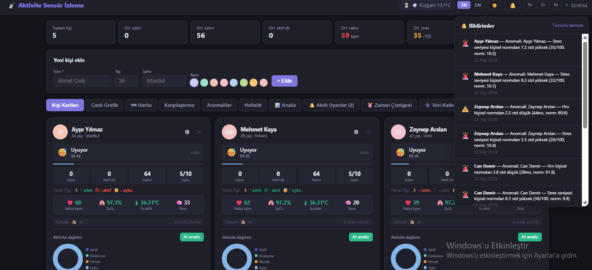

### 📈 Canlı Grafik


### 🗺️ Harita
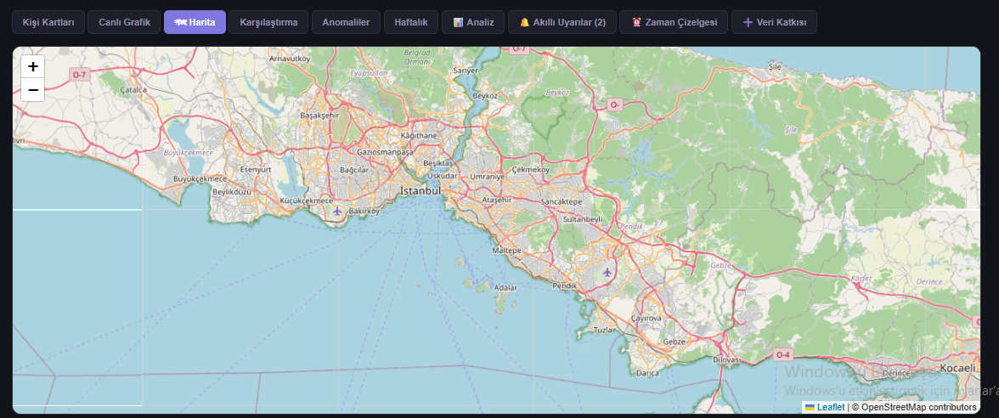

### ⚖️ Karşılaştırma


### ⚠️ Anomaliler
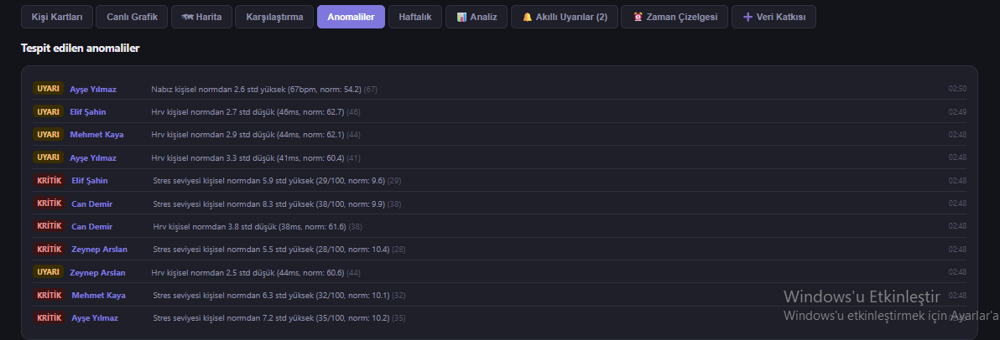

### 📅 Haftalık Görünüm


### 🔬 Genel Analiz
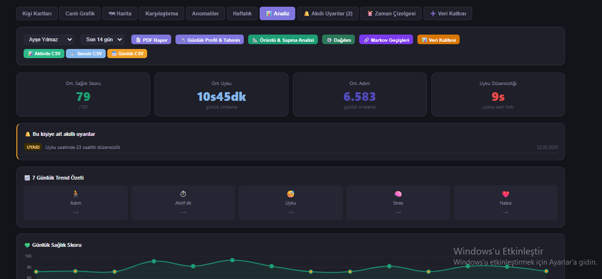

### 💚 Sağlık Skoru


### ❤️ Nabız Trend
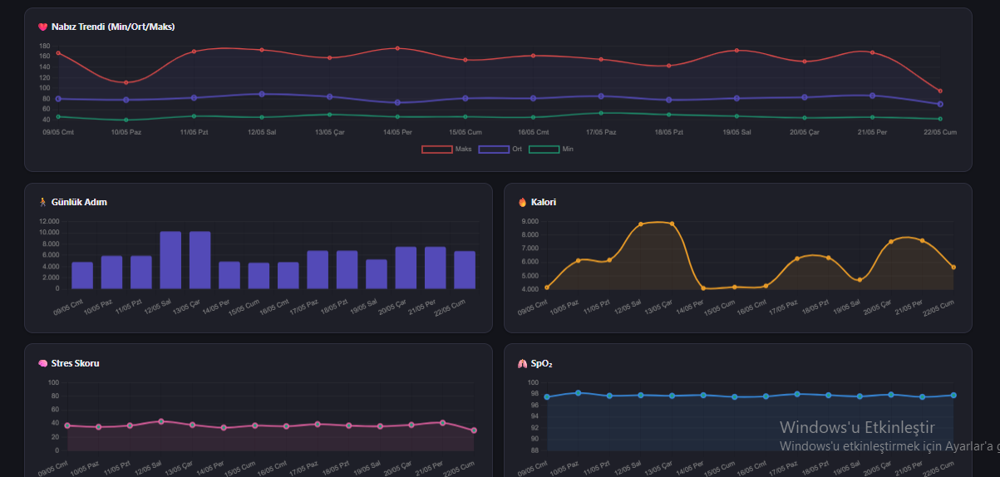

### ⏱️ Aktif Süre


### 🌡️ Isı Haritası
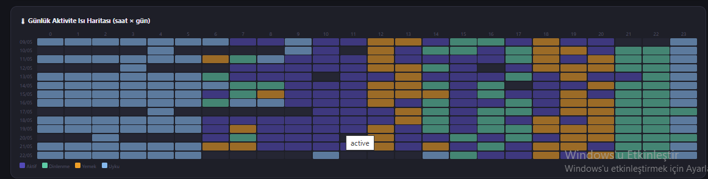

### 📊 Örüntü & Sapma
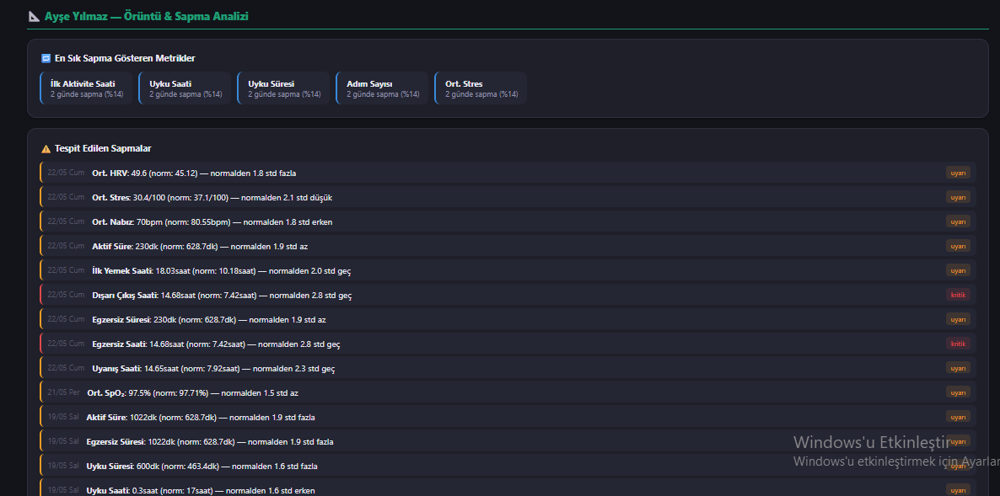

### ⚙️ Dağılım Ayarları
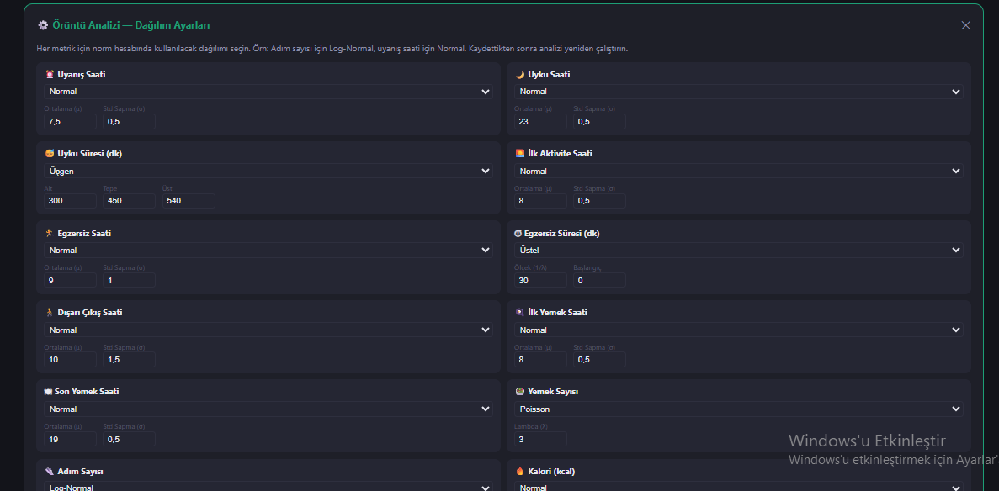

### 🕐 Zaman Örüntüleri


### 💓 Biyometrik Metrikler
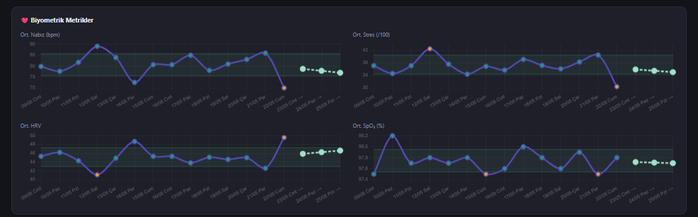

### 🔮 Gelecek Tahmini
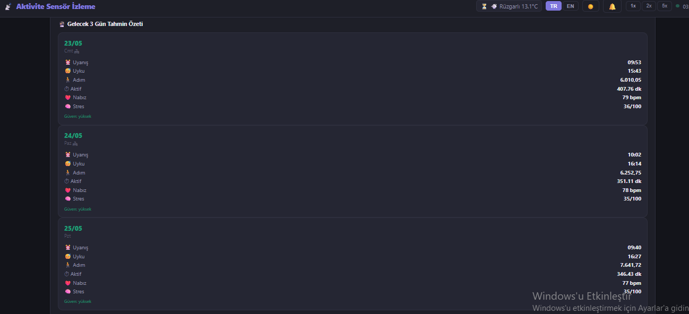

### 🔗 Markov Geçiş Matrisi


### 🕐 Markov Saat Haritası
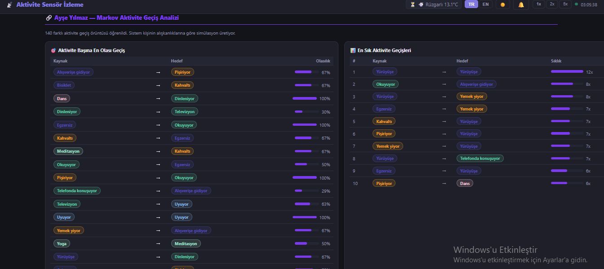

### ✅ Veri Kalite Analizi
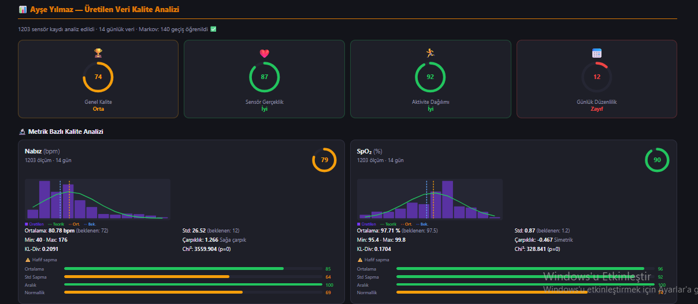

### 📉 Aktivite Dağılımı
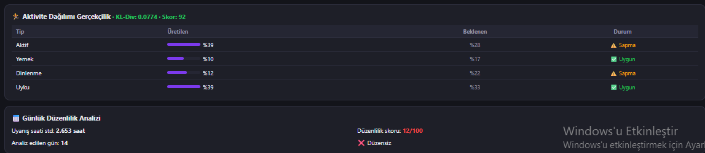

### 🔔 Akıllı Uyarılar
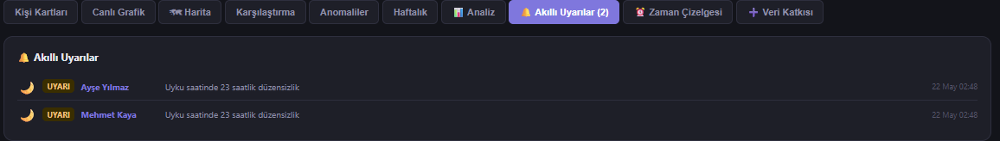

### 📋 Zaman Çizelgesi
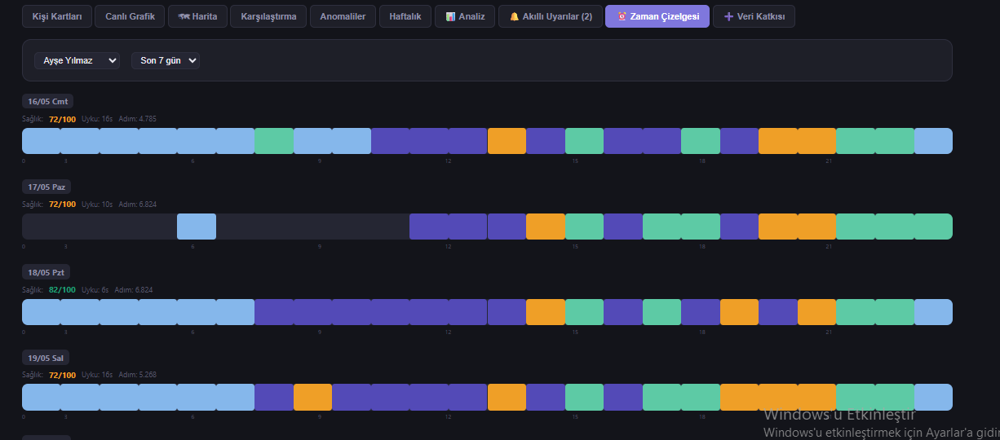

### 🤝 Veri Katkısı


---

## Gereksinimler

```
flask
flask-cors
flask-socketio
```